# Node.js Authentication System

This project contains a complete authentication system using Node.js, Express, and MongoDB. It includes features like sign up, sign in, sign out, password reset, and social authentication (Google). The project is structured to be scalable with separate components for models, controllers, and routes.

## Live Site
[Click here](https://nodejs-authentication-system-l2pu.onrender.com/user/signin) to visit the live site.

## Features Implemented
- **Sign-up with Email**: Create an account using your email and password.
- **Sign-in**: Log into your account securely.
- **Sign Out**: Log out of your session.
- **Reset Password**: You can reset your passwords after signing in.
- **Encrypted Passwords**: Passwords are securely stored using encryption.
- **Google Login/Signup**: Sign in or sign up using your Google account.
- **Forgot Password**: Reset your password via email.
- **Password Strength Validation**: Notifications are displayed for unmatching passwords during sign up and incorrect passwords during sign in.
- **reCAPTCHA Integration**: Protects against bot traffic on sign up and login pages.

## Environment Variables

Before running the application locally, ensure you have set up the following environment variables in a .env file located at the root of your project:

1. **PORT**: Specifies the port number the application listens on.
2. **DB_URL**: MongoDB database connection URL.
3. **CLIENT_ID**: Google OAuth client ID.
4. **CLIENT_SECRET**: Google OAuth client secret (sign in with Google).
5. **EMAIL**: Email address for sending emails.
6. **PASSWORD**: App-specific password or regular password for the Gmail account.
7. **RECAPTCHA_SECRET_KEY**: Google reCAPTCHA secret key.
8. **CLIENT_URL**: URL to redirect after signing in with Google, e.g., "http://localhost:3000/auth/login/success".

Ensure that you have the appropriate values for each variable before running the application.

Example `.env` file:

```plaintext
PORT=3000
DB_URL=mongodb://localhost:27017/authdatabase
CLIENT_ID=your_client_id
CLIENT_SECRET=your_client_secret
EMAIL=your_email@gmail.com
PASSWORD=your_gmail_password
RECAPTCHA_SECRET_KEY=your_recaptcha_secret_key
CLIENT_URL=http://localhost:3000/auth/login/success
```

## Folder
  ```csharp
node-authentication/
├── config/                  # Configuration files
│   └── mongodb.js           # MongoDB configuration
│
├── controllers/             # Controller logic
├── models/                  # Database models
├── routes/                  # Route definitions
├── views/                   # EJS views
├── app.js                   # Express application setup
│
├── public/                  # Static assets
│
├── package.json             # NPM package configuration
├── README.md                # Project README file
├── .gitignore               # Git ignore configuration
└── .env                     # Environment variables file

```

## Installation and Setup

Follow these steps to run the project locally:


1. Clone the repository to your local machine:

   ```bash
   git clone https://github.com/your-username/nodejs-authentication-system.git
  
2. Navigate into the project directory:
   ```bash
   cd node-authentication-system
    ```
3. Install dependencies:
   ```bash
   npm install

4. Start the server:
   ```bash
   npm start
5. Open your web browser and visit http://localhost:3000 to access the application.

## Dependencies required

- Express.js
- MongoDB
- Passport.js
- bcrypt
- express-session
- express-ejs-layouts
- dotenv
- nodemailer

## Credits

This project was created by [Ravikant Singh](https://github.com/ravikantsingh12). Contributions via issues or pull requests are welcome!

## Follow me on

- [LinkedIn](https://www.linkedin.com/in/ravikant-singh-327a98241)

# TẠO CLIENT_ID  và CLIENT_SECRET
## CLIENT_ID = username của ứng dụng.
## CLIENT_SECRET = password của ứng dụng.
Bước1: Truy cập https://console.cloud.google.com/
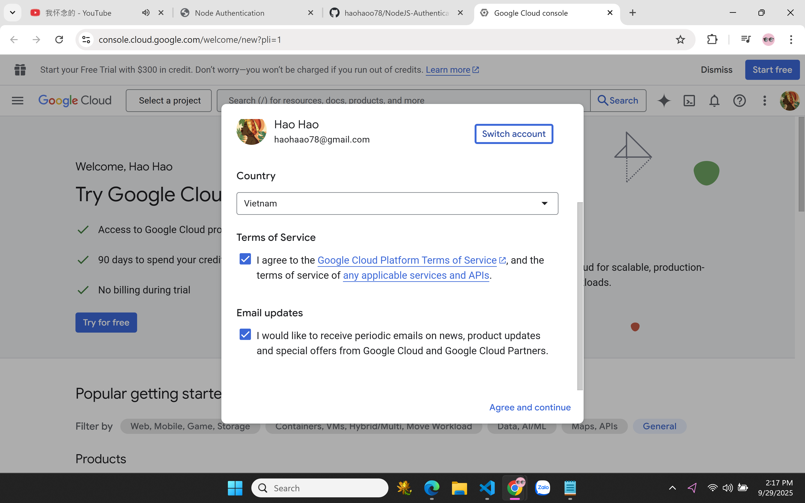

Bước 2: Vào Select a project -> nhấn new project 
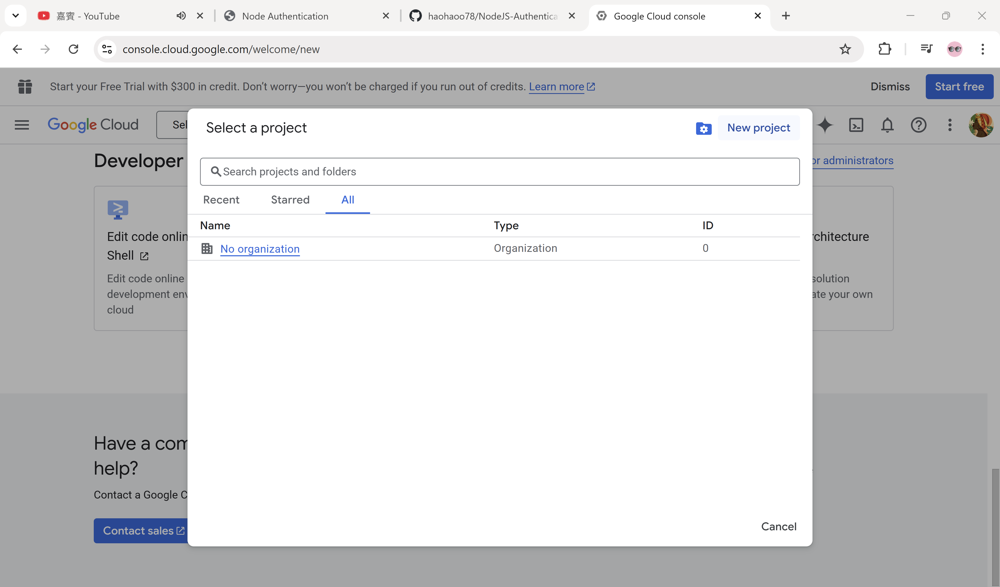

Bước 3: Điền tên new project -> nhấn create
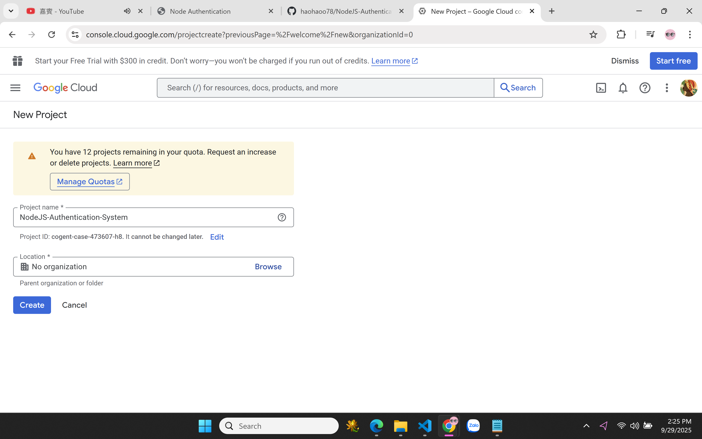

Bước 4: Select a project với tên project vừa tạo 
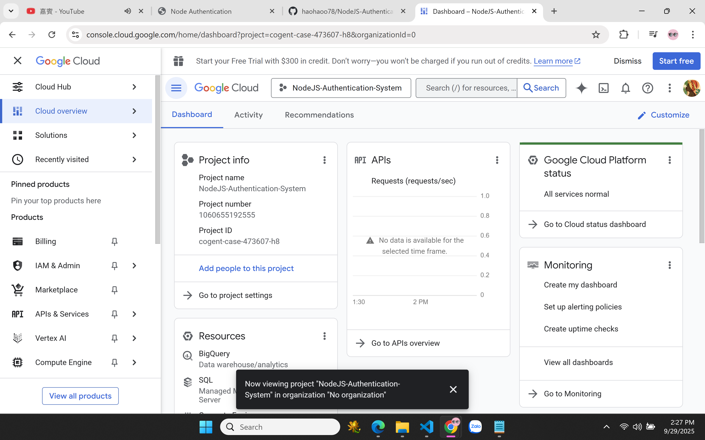

Bước 5: Trong menu bên trái → APIs & Services → Library -> Tìm Gmail API → nhấn Enable (Bật).
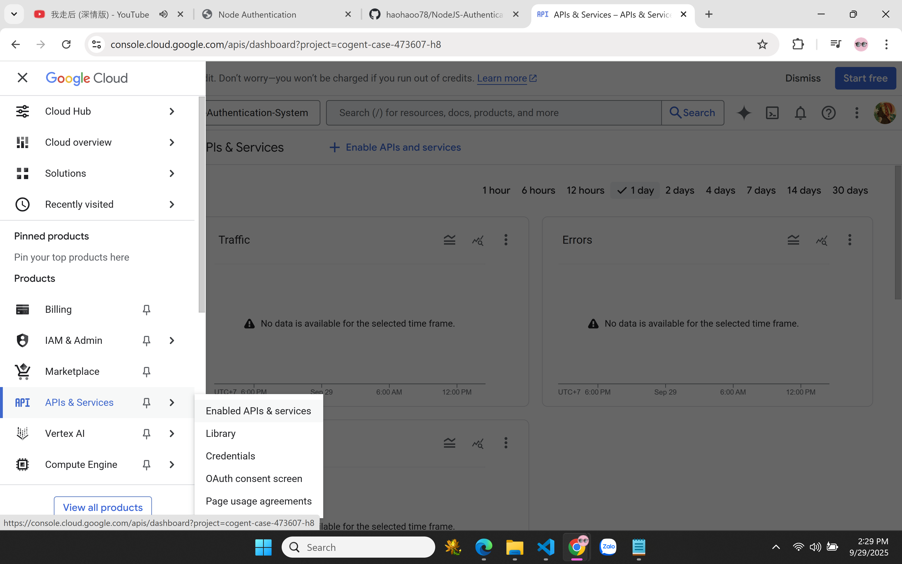
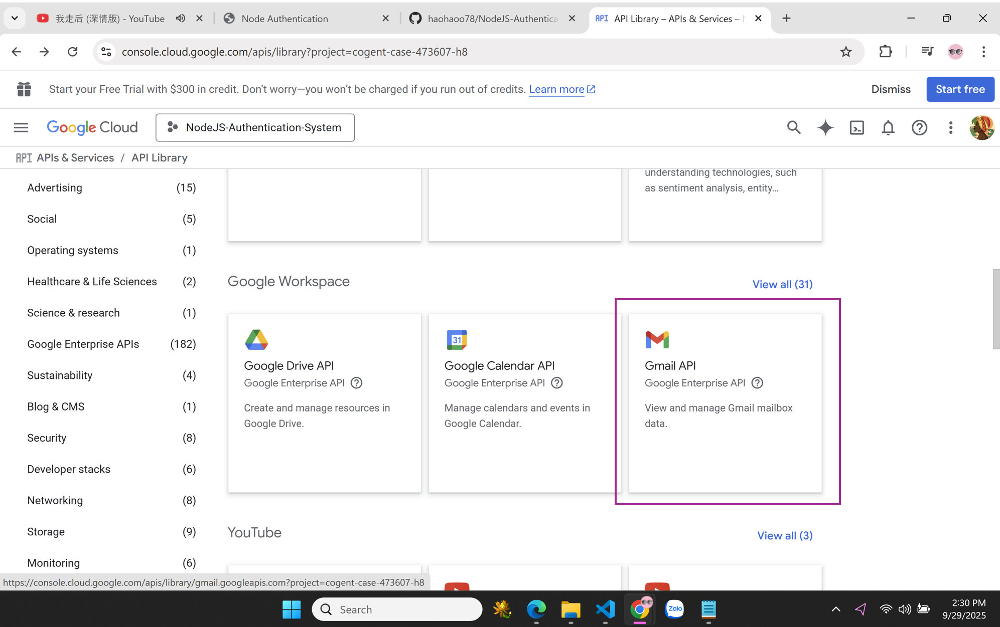

Bước 6: Trong APIs & Services -> → Credentials → OAuth client ID.
Nếu chưa setup OAuth Consent Screen
Trong menu bên trái → APIs & Services → chọn OAuth Consent Screen.
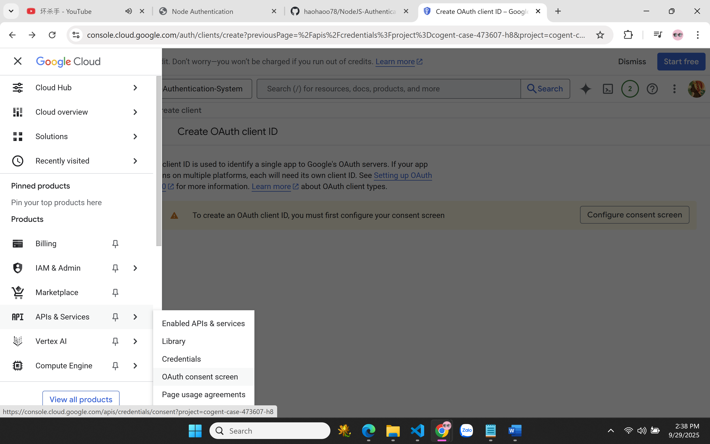
Điền App Name, Email-> next 
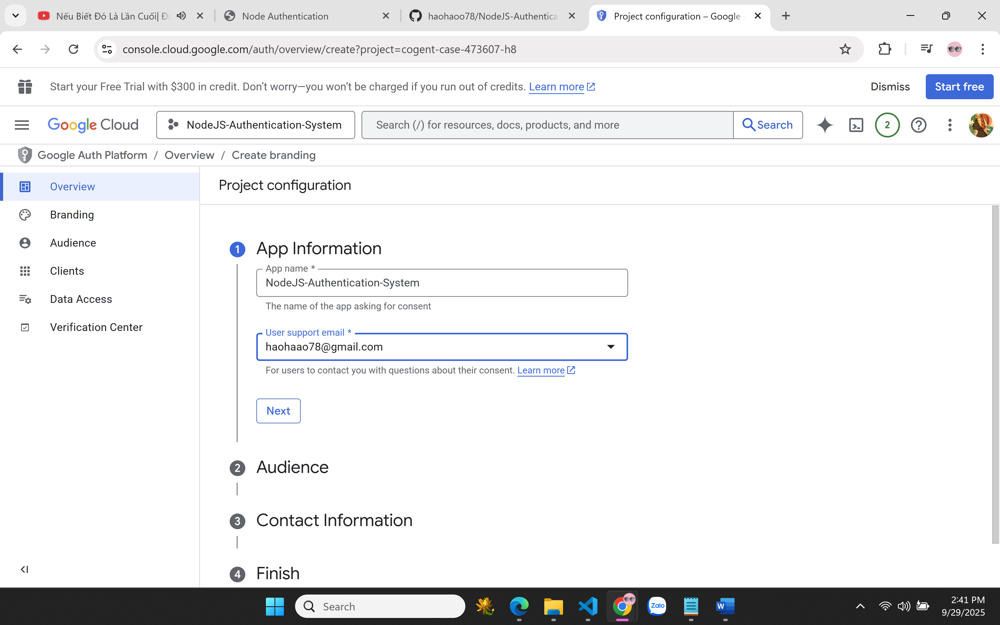
Chọn External -> next
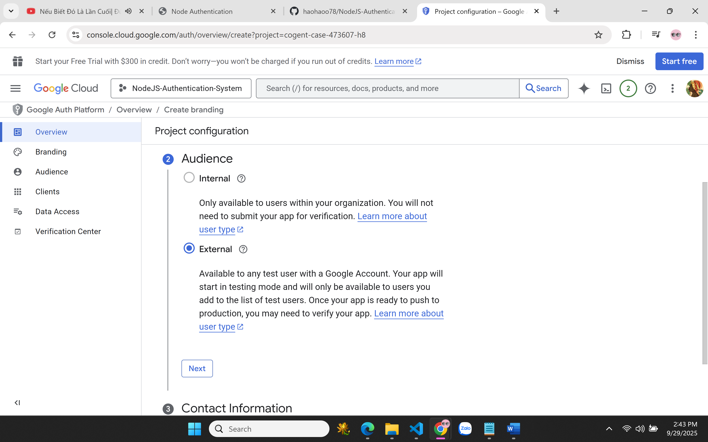
Điền email contact information -> next -> continue -> nhấn Create.
Sau đó quay lại → chọn OAuth Client ID -> Chọn Web application ->  Điền thông tin -> nhấn Create.
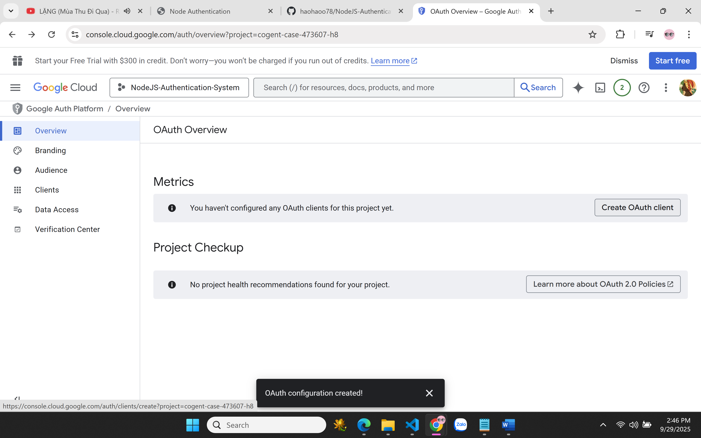
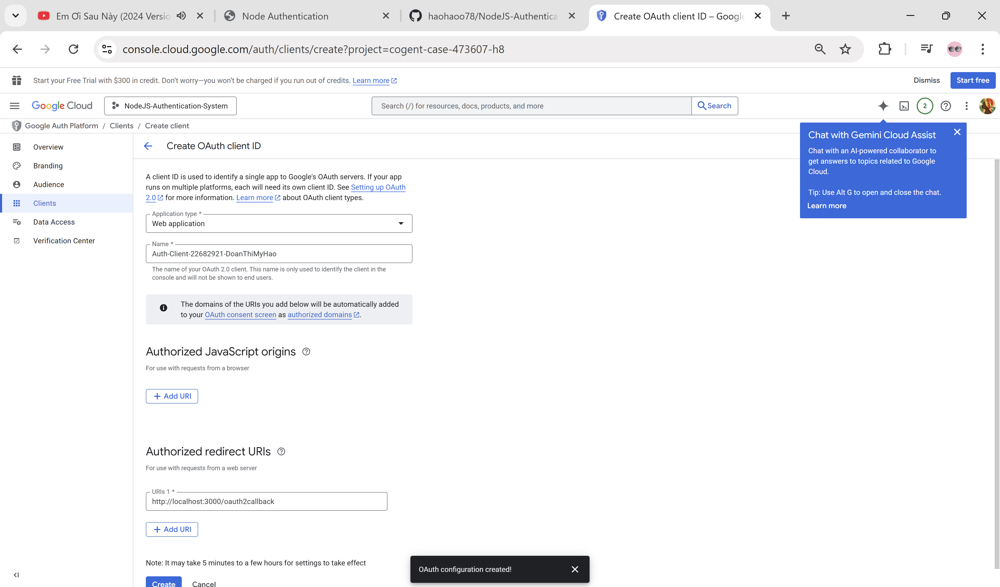

## Kết quả
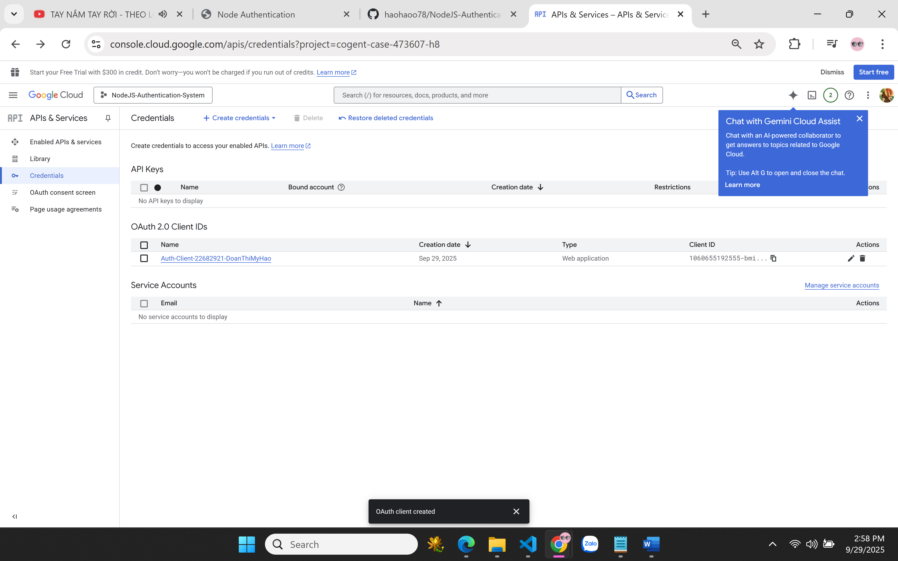
